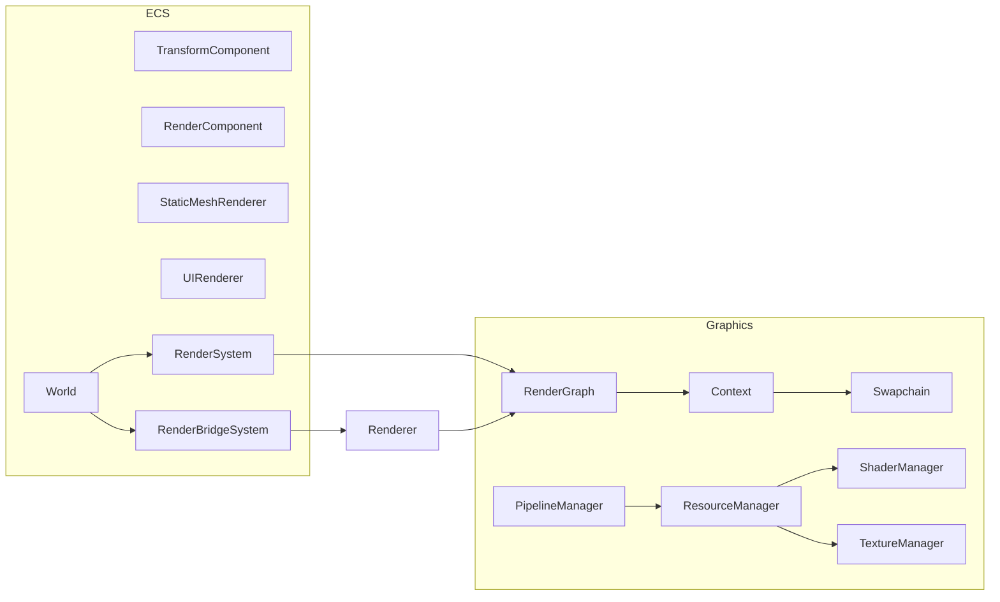

# Architecture Principles

## Module Independence and Data-Driven Design

AshEngine follows a modular, data-driven architecture that emphasizes loose coupling between systems while maintaining high cohesion within each module. This design philosophy is built around several key principles:

### 1. Renderable Interface Pattern

Each major system (Physics, Lighting, Mesh) implements a common Renderable interface:

```rust
pub trait Renderable {
    fn prepare_render_data(&self) -> RenderData;
    fn update(&mut self, delta_time: f32);
}
```

This pattern allows modules to:

- Manage their own state independently
- Define their own update logic
- Provide standardized render data to the graphics system

### 2. Data-Driven Communication

Modules communicate through well-defined data structures rather than direct dependencies:

```rust
pub struct RenderData {
    // Standardized data format for rendering
    mesh_data: Vec<MeshData>,
    light_data: Option<LightingData>,
    debug_data: Option<DebugRenderData>,
}
```

Benefits:

- Clear boundaries between systems
- Simplified testing and debugging
- Reduced coupling between modules
- Easier to extend and modify individual systems

### 3. Module Independence

Each module (Physics, Lighting, Mesh, etc.) operates as an independent system:

- Manages its own state and lifecycle
- Controls its own update frequency
- Handles its own resource management
- Can be tested in isolation

### 4. Graphics System as a Service

The graphics module acts as a service that:

- Accepts standardized render data from other modules
- Doesn't make assumptions about data sources
- Maintains clean separation between rendering and game logic
- Provides a stable interface for visual output

### 5. Entity Component System (ECS)

The engine is transitioning to an ECS architecture that enhances our existing modular design:

- Provides a unified approach to game object management
- Maintains compatibility with existing systems through bridge patterns
- Enables better performance through data-oriented design
- Facilitates parallel processing and cache efficiency

For detailed information about our ECS implementation, see the [ECS documentation](./ecs.md).

The following diagram illustrates the interaction between the ECS and graphics systems:



#### ECS Integration Strategy

Our ECS integration follows a phased approach:

1. Bridge Systems: Adapting existing modules through bridge components and systems
2. Core Systems Migration: Gradual transition of core functionality to ECS
3. Legacy System Deprecation: Complete transition to ECS-native implementations

This approach ensures:

- Minimal disruption to existing functionality
- Proper testing and validation
- Smooth transition for developers
- Performance optimization opportunities

## Implementation Guidelines

When implementing new features or modules:

1. Define clear data interfaces before implementation
2. Keep module-specific logic contained within its module
3. Use the Renderable trait for graphics integration
4. Avoid direct dependencies between modules
5. Design for testability and isolation
6. Consider ECS compatibility for new features
7. Use bridge patterns when integrating with existing systems

This architecture allows AshEngine to:

- Scale efficiently as new features are added
- Maintain clean separation of concerns
- Support parallel development
- Facilitate testing and debugging
- Enable easy addition of new modules and features
- Optimize performance through data-oriented design
