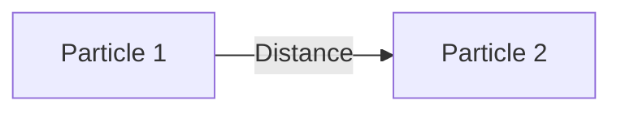
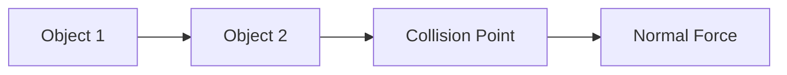
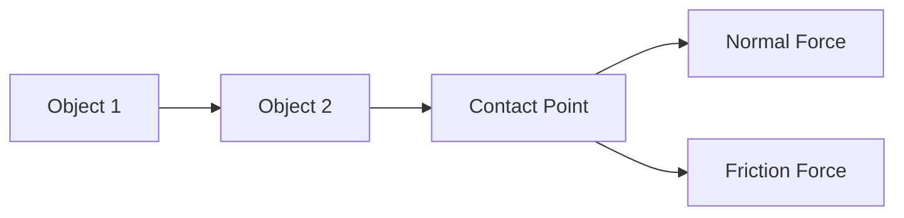
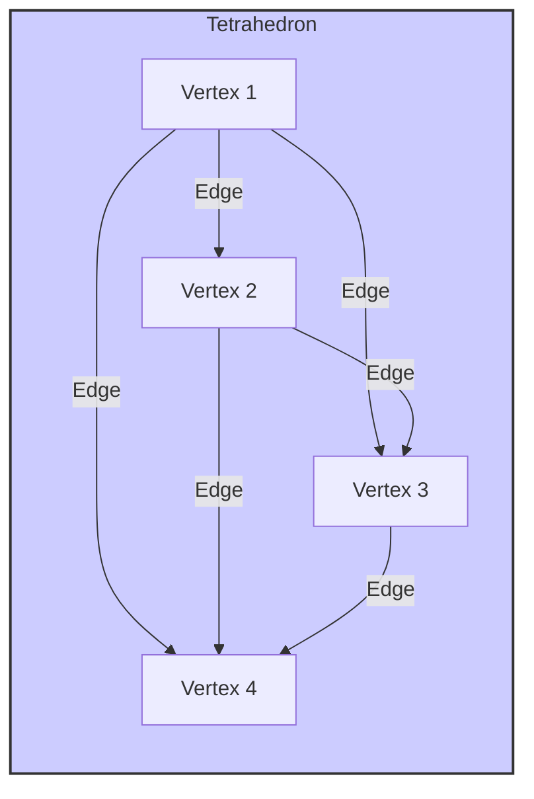

# Constraint Systems Overview

This document provides a general overview of constraint systems in physics simulations, their types, solvers, applications, and advantages/disadvantages.

## What are Constraint Systems?

Constraint systems are a fundamental part of many physics engines. They allow developers to define relationships between objects and enforce rules that govern their motion. Instead of directly manipulating object positions and velocities, constraints provide a higher-level way to control interactions and create realistic physical behavior. Constraints are typically expressed as equations or inequalities that the physics engine must try to satisfy at each time step.

## Types of Constraints

There are many different types of constraints, each suited for different purposes:

### Distance Constraints

Distance constraints maintain a fixed distance between two particles or points on objects.



### Collision Constraints

Collision constraints prevent objects from interpenetrating. They are typically generated when a collision is detected and are used to calculate the appropriate response (e.g., bouncing, sliding).



### Joint Constraints

Joint constraints restrict the relative motion between two rigid bodies. Common joint types include:

- **Hinge Joint:** Allows rotation around a single axis.

  ```mermaid
  graph LR
      A[Body 1] -- Hinge --> B[Body 2]
      A --> C[Hinge Axis]
  ```

- **Ball-and-Socket Joint:** Allows rotation around all three axes.

  ```mermaid
  graph LR
      A[Body 1] -- Ball --> B[Body 2]
      B --> C[Socket]
  ```

- **Prismatic Joint** Allows movement along one axis.
  ```mermaid
  graph LR
      A[Body 1] -- Axis --> B[Body 2]
  ```

### Contact Constraints

Contact constraints handle the interactions between objects that are in contact, including friction and restitution (bounciness).



### Volume Constraints

Volume constraints are commonly used in soft body simulations to maintain the volume of deformable objects.



### Other Specialized Constraints

Other specialized constraints exist for specific purposes, such as:

- **Cloth Constraints:** Used to simulate the behavior of cloth, often involving distance and bending constraints between particles.
- **Rope Constraints** Used to simulate ropes.

## Constraint Solvers

Constraint solvers are algorithms that attempt to satisfy the constraint equations. Common solver types include:

- **Iterative Solvers (Jacobi, Gauss-Seidel):** These solvers iteratively adjust object positions or velocities to reduce constraint violations. They are relatively simple to implement but may require many iterations to converge.
- **Projected Gauss-Seidel (PGS):** A variation of the Gauss-Seidel method often used in Position-Based Dynamics (PBD). It projects particle positions to satisfy constraints.
- **Sequential Impulses:** This solver applies impulses to objects to resolve collisions and other constraints. It is commonly used for rigid body simulations.
- **Island-based Solvers:** As described in [Island-Based Constraint Solving](./parallelism_islands.md), these solvers group connected objects and constraints into independent "islands" that can be solved in parallel.

## Best Uses and Applications

Constraint systems are used in a wide range of applications, including:

- **Rigid Body Simulations:** Simulating the motion of solid objects, including collisions, stacking, and jointed structures.
- **Soft Body Simulations:** Simulating deformable objects like cloth, rubber, and soft tissues.
- **Character Animation:** Creating realistic character movement with ragdoll physics and inverse kinematics.
- **Robotics Simulations:** Modeling and controlling robots with joints and actuators.
- **Cloth and Fluid Simulations:** While often using specialized techniques, these simulations can sometimes incorporate constraints to handle interactions with other objects.

## Advantages and Disadvantages of Constraint Systems

**Advantages:**

- **Intuitive:** Constraints provide a natural way to define relationships between objects.
- **Stable:** They can lead to more stable simulations compared to directly manipulating forces or velocities.
- **Flexible:** A wide variety of constraints can be used to create complex behaviors.
- **Controllable:** Constraints offer a high degree of control over object interactions.

**Disadvantages:**

- **Computational Cost:** Solving constraints can be computationally expensive, especially for complex systems.
- **Parameter Tuning:** Finding the right parameters (e.g., stiffness, damping) for constraints can be challenging.
- **Drift:** Iterative solvers may not perfectly satisfy constraints, leading to drift over time.
- **Complexity:** Implementing and debugging constraint systems can be complex.
