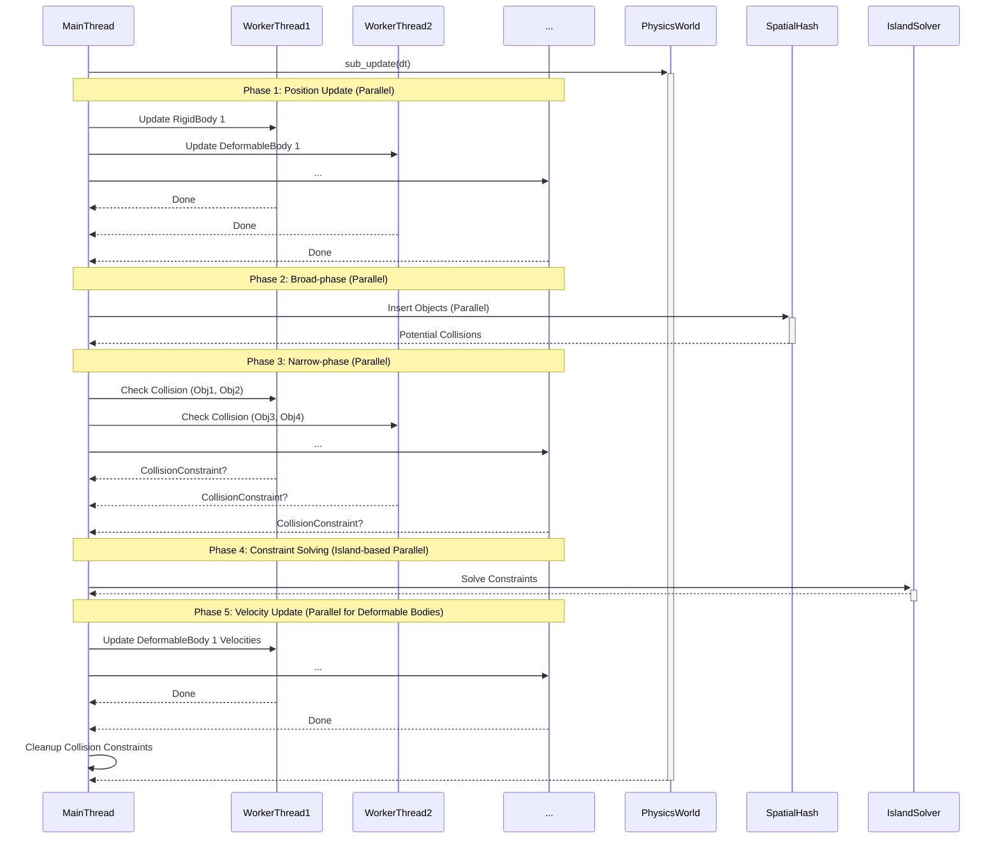

# Current CPU Parallelism

This diagram illustrates the current CPU parallelization strategy within the AshEngine physics system. The main phases of the physics update (`sub_update` function in `physics.rs`) are shown, with highlights indicating the sections that utilize parallel processing via the `rayon` crate.

**Explanation:**

1.  **Position Update:** Object positions and velocities are updated in parallel using `rayon`'s parallel iterators. Both rigid bodies and deformable bodies are handled.
2.  **Broad-phase Collision Detection:** Objects are inserted into the spatial hash in parallel, again using `rayon`.
3.  **Narrow-phase Collision Detection:** Potential collision pairs identified by the broad-phase are processed in parallel to determine actual collisions and generate collision constraints.
4.  **Constraint Solving:** The island-based constraint solver groups independent constraints into "islands" and solves them in parallel.
5.  **Velocity Update:** Velocities of deformable bodies are updated in parallel.
6.  **Cleanup:** Temporary collision constraints are removed.
