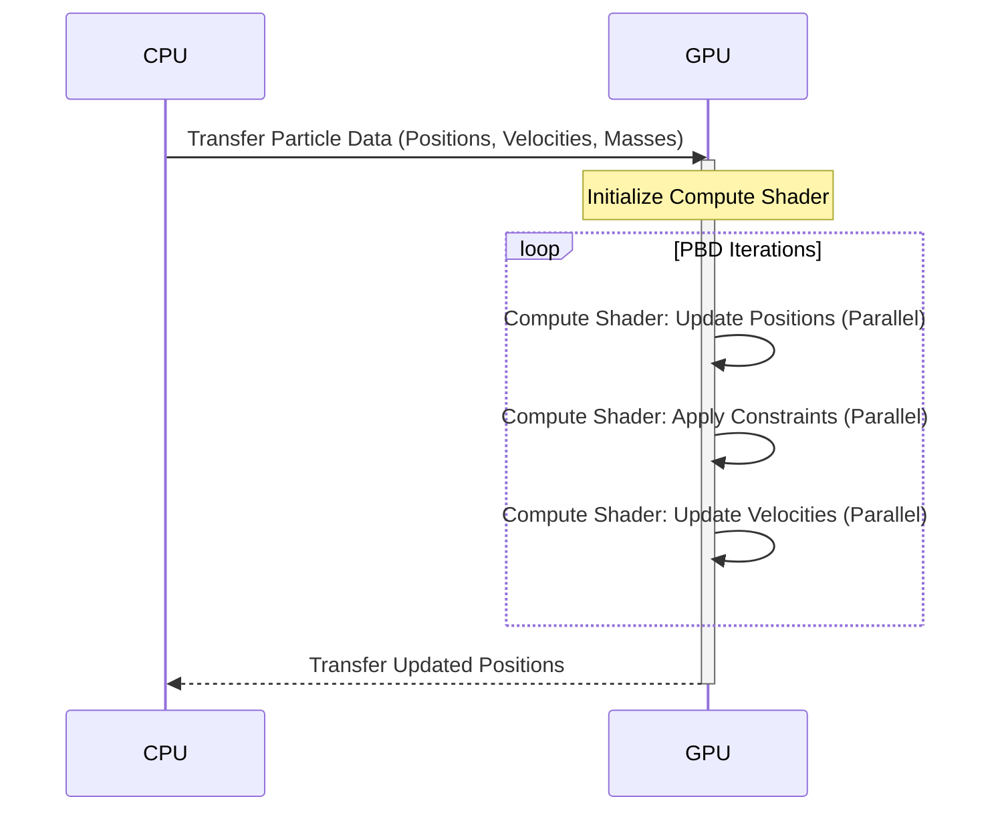

# GPU-Accelerated PBD

This diagram illustrates how Position-Based Dynamics (PBD) calculations for deformable bodies can be offloaded to the GPU using compute shaders.

**Explanation:**

1.  **Data Transfer:** Particle data (positions, velocities, masses) is transferred from the CPU to the GPU.
2.  **Compute Shader Initialization:** A compute shader is initialized on the GPU.
3.  **PBD Iterations:** The core PBD calculations are performed within a loop on the GPU:
    - **Update Positions:** Particle positions are updated based on their velocities.
    - **Apply Constraints:** Constraints (e.g., volume preservation, distance constraints) are applied to the particles.
    - **Update Velocities:** Particle velocities are updated based on the position changes.
      These steps are executed in parallel for all particles within the compute shader.
4.  **Data Transfer:** The updated particle positions are transferred back from the GPU to the CPU.

This approach leverages the massive parallelism of the GPU to significantly accelerate the PBD simulation.
