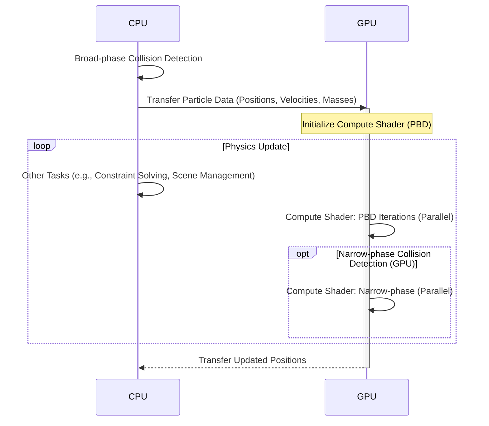

# Hybrid Parallelism (CPU + GPU)

This diagram illustrates a potential hybrid parallelization approach, combining CPU and GPU processing for optimal performance.

**Explanation:**

- **CPU:**
  - Handles broad-phase collision detection using the spatial hash.
  - Performs other tasks, such as constraint solving (using the island-based solver), scene management, and game logic.
- **GPU:**
  - Executes Position-Based Dynamics (PBD) calculations for deformable bodies using compute shaders.
  - Optionally, could also handle narrow-phase collision detection using compute shaders, especially for scenes with a large number of deformable objects.

This hybrid approach distributes the workload between the CPU and GPU, taking advantage of their respective strengths. The CPU is well-suited for tasks with complex control flow and data dependencies, while the GPU excels at massively parallel computations.
