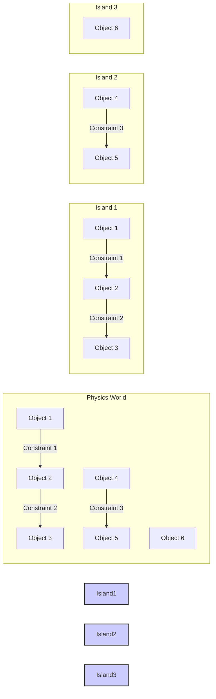

# Island-Based Constraint Solving

This diagram illustrates the concept of island-based constraint solving for parallel processing.

**Explanation:**

- **Physics World:** The overall physics world contains multiple objects and constraints.
- **Islands:** Objects and constraints that are directly or indirectly connected to each other form "islands." In this example, we have three islands:
  - **Island 1:** Objects 1, 2, and 3 are connected by Constraints 1 and 2.
  - **Island 2:** Objects 4 and 5 are connected by Constraint 3.
  - **Island 3:** Object 6 is not connected to any other objects.
- **Parallel Solving:** Each island can be solved independently and in parallel with other islands. This is because the constraints within one island do not affect the objects in other islands.

This island-based approach allows the constraint solver to efficiently utilize multiple CPU cores, significantly improving performance for complex simulations with many interacting objects.
